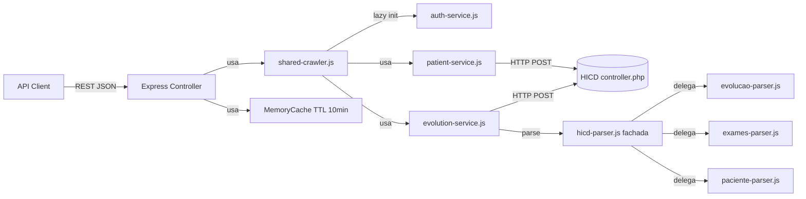

---
tags:
  - akita/arquitetura
aliases:
  - Arquitetura
updated: 2026-05-21
---

# 01 · Visão Geral da Arquitetura

[[CLAUDE|← voltar ao Hub]]

---

## Organização do código

- **Tipo:** monorepo
- **Divisão:** camadas independentes no mesmo repositório (crawler core + REST API + frontend Angular WIP)

---

## Camadas

```
┌─────────────────────────────────────────────────┐
│  Angular Frontend  (hicd-frontend/)             │  ← SPA (work in progress)
├─────────────────────────────────────────────────┤
│  REST API          (api/ + api-server.js)        │  ← Express, porta 3000
├─────────────────────────────────────────────────┤
│  Crawler Core      (src/ + hicd-crawler-refactored.js) │  ← scraping + parsing
├─────────────────────────────────────────────────┤
│  HICD Server externo (controller.php)           │  ← origem dos dados
└─────────────────────────────────────────────────┘
```

---

## Fluxo de dados

```
HTTP Request → Express Router → Controller
  → initCrawler() [lazy auth] → HICDCrawler
    → EvolutionService / PatientService
      → HICDHttpClient (POST controller.php)
        → HICDParser → Parser especializado (cheerio)
  → api/models/* (fromParserData) → JSON response
```

---

## Padrão arquitetural

**Clean Architecture informal** com 4 camadas:

| Camada | Diretório | Responsabilidade |
|--------|-----------|-----------------|
| Infra | `src/core/` | HTTP client, cookies, rate limit |
| Services (application) | `src/services/` | Casos de uso: auth, paciente, evolução |
| Adapters | `src/parsers/` | HTML → objetos JS |
| Presentation | `api/controllers/` + `api/routes/` | Request/response HTTP |
| Entidades/DTOs | `api/models/` | Estrutura de dados + serialização |

> [!warning] Dependências apontam para dentro
> Controllers → Services → Parsers/Core. Parsers **nunca** fazem chamadas HTTP. Services **nunca** fazem parse de HTML diretamente.

---

## Diagrama



---

## Quirk crítico — primeiro login sempre falha

> [!warning] Não remova o retry de login
> O HICD exige dois logins — o primeiro sempre falha por design. O `auth-service.js` faz retry automático. Este comportamento é **intencional no servidor HICD**, não um bug nosso.

---

## Notas relacionadas

- [[02-stack]]
- [[03-estrutura-diretorios]]
- [[08-infraestrutura]]
- [[_componentes/auth-service|auth-service]]
- [[_componentes/hicd-parser|hicd-parser (fachada)]]
